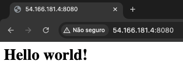

# Example 01 - Running EC2 instance with a Hello World page

## Getting Started

```bash
terraform init
```

> Terraform will download the necessary provider plugins and set up the backend configuration. This step is typically performed before running any other Terraform commands in a project.

```bash
terraform plan
```

> Terraform analyzes your configuration files and the current state of your infrastructure to determine what changes need to be made. It then generates a detailed report that outlines the actions it will take to achieve the desired state defined in your configuration files. This includes creating new resources, modifying existing resources, or destroying resources that are no longer needed.

```bash
terraform apply
```

> Terraform will apply the changes defined in the Terraform configuration files to the target infrastructure. This command is typically used after making changes to the Terraform configuration files to deploy or update the infrastructure resources.

### Setup a SSH key

In order to access the instance, create and associate a pair of SSH keys at AWS.

[https://docs.aws.amazon.com/pt_br/AWSEC2/latest/UserGuide/create-key-pairs.html](https://docs.aws.amazon.com/pt_br/AWSEC2/latest/UserGuide/create-key-pairs.html)

or via terminal:

```bash
ssh-keygen -m PEM
```

Add the previous key at the instance (the `<name>.pub` file).

### Add Inbound/Outbound rules to the default security group

To add Inbound/Outbound rules to the default security group in EC2, you can follow the documentation provided by AWS:

[Adding Rules to a Security Group](https://docs.aws.amazon.com/pt_br/AWSEC2/latest/UserGuide/ec2-security-groups.html#adding-security-group-rule)

### Connect to the instance

To connect to an EC2 instance, you can follow the documentation provided by AWS:

[Connecting to Your Linux Instance Using SSH](https://docs.aws.amazon.com/pt_br/AWSEC2/latest/UserGuide/AccessingInstancesLinux.html)

Something like:

```bash
ssh -i "~/.ssh/aws-ec2-access" ec2-user@ec2-54-166-181-4.compute-1.amazonaws.com
```

If everything is cool, you should see something like:

```bash
ec2-user@ip-172-31-83-14.ec2.internal ~
```

### Create an index.html file

At the terminal's instance:

```bash
echo "<h1>Hello World!</h1>" > index.html
```

### Run server inside the terminal's instance

BusyBox - includes simple versions of many commands found in larger coreutils, such as ls, cp, mv, rm, echo, and many others. The main goal of BusyBox is to be lightweight and efficient, which is why it’s commonly used in environments where space and memory are constrained, like in embedded devices, small Linux distributions, or Docker containers

Nohup - The nohup command in Unix/Linux is used to run a command or script in the background even after the user has logged out of the terminal. “Nohup” stands for “no hang up,” which prevents the process from being terminated when the terminal session is closed.

```bash
nohup busybox httpd -f -p 8080 & 
```

### Accessing the page

If everything is cool, we just need to take the EC2's IP and add the port.

Something like:



--

## Terraform and Ansible

It prevent's to destroy the application. Only applies what is needed to be done.

```bash
ansible-playbook playbook.yaml -u ec2-user --private-key ~/.ssh/aws-ec2-access -i hosts.yaml
```

If everything is cool, you should see something like this:


