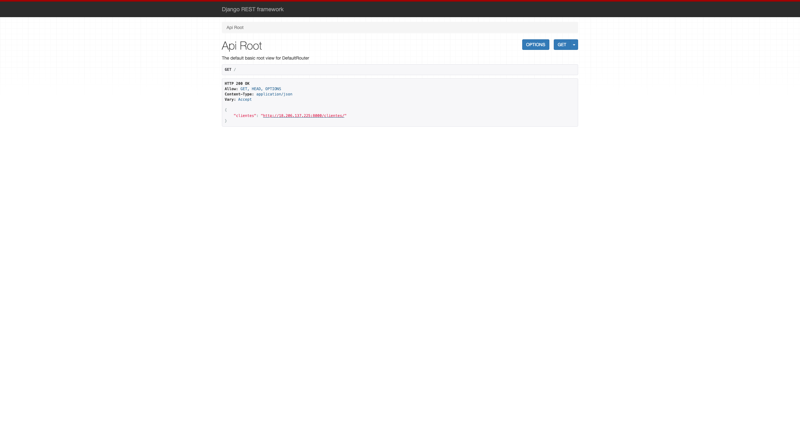

# Example 03 - Running Python, virtualenv, Django web API and AWS - with everything in place

## Getting Started

```bash
terraform init
```

> Terraform will download the necessary provider plugins and set up the backend configuration. This step is typically performed before running any other Terraform commands in a project.

```bash
terraform plan
```

> Terraform analyzes your configuration files and the current state of your infrastructure to determine what changes need to be made. It then generates a detailed report that outlines the actions it will take to achieve the desired state defined in your configuration files. This includes creating new resources, modifying existing resources, or destroying resources that are no longer needed.

```bash
terraform apply
```

> Terraform will apply the changes defined in the Terraform configuration files to the target infrastructure. This command is typically used after making changes to the Terraform configuration files to deploy or update the infrastructure resources.

## Run

```bash
terraform output
```

It will show something like:

```bash
IP = "18.212.162.98"
```

```bash
ansible-playbook env/dev/playbook.yaml -u ec2-user --private-key ~/.ssh/aws-ec2-access -i infra/hosts.yaml
```

## For prod version

If everything is fine, you will see:

