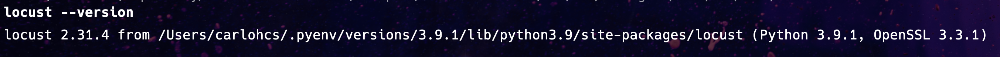
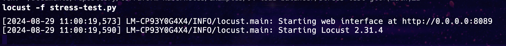
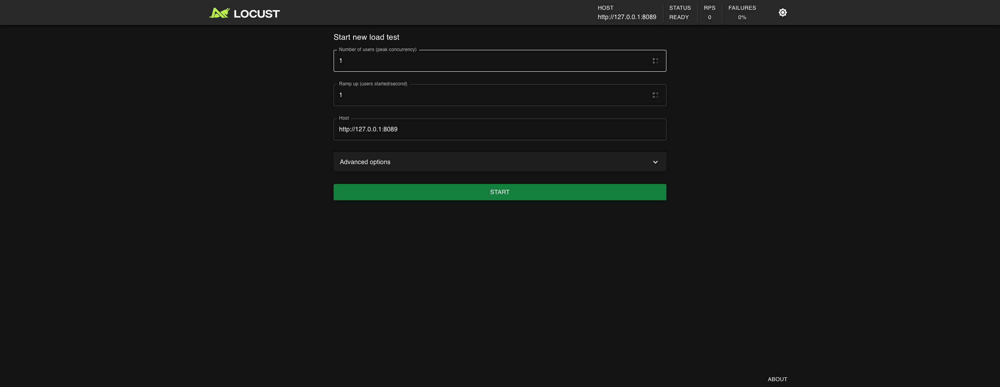

# Example 04 - Running Python, virtualenv, Django web API and AWS and Load Balancer and Stress Test

## Getting Started

```bash
terraform init
```

> Terraform will download the necessary provider plugins and set up the backend configuration. This step is typically performed before running any other Terraform commands in a project.

```bash
terraform plan
```

> Terraform analyzes your configuration files and the current state of your infrastructure to determine what changes need to be made. It then generates a detailed report that outlines the actions it will take to achieve the desired state defined in your configuration files. This includes creating new resources, modifying existing resources, or destroying resources that are no longer needed.

```bash
terraform apply
```

> Terraform will apply the changes defined in the Terraform configuration files to the target infrastructure. This command is typically used after making changes to the Terraform configuration files to deploy or update the infrastructure resources.

## Install

- pip (it comes with python's installation);
- virtualenv (`pip install virtualenv`);
- Activate the virtualenv: 

```bash
virtualenv venv
source venv/bin/activate
```

- `pip install locust`
- `locust --version`

it will show something like:



## Stress test

Enter into [./stress-test](./stress-test) and run:

```bash
locust -f stress-test.py
```

it will show something like:



Get the local ip

```bash
ipconfig getifaddr en0
```

it will show something like:

`192.168.68.103`

Access it in browser `http://192.168.68.103:8089` and it will show the LOCUST interface:



Go to AWS load balancer. Take the DNS name. Something like:

`EC2 > Load Balancers > Select the created one > Details > DNS name`

It should be something like:

`load-balancer-806075364.us-east-1.elb.amazonaws.com`

Put this info at LOCUST (add `http://` before), something like:

`http://load-balancer-806075364.us-east-1.elb.amazonaws.com:8000/clientes`

### The test


