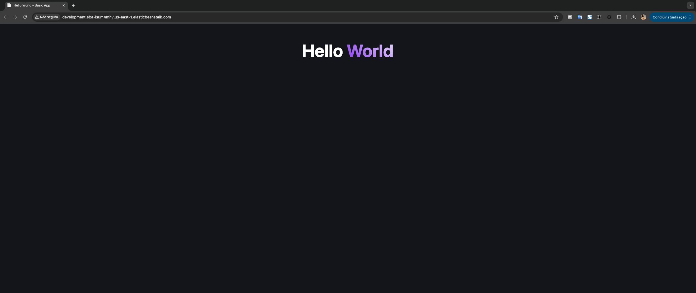
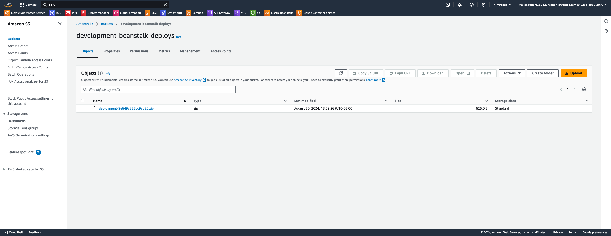
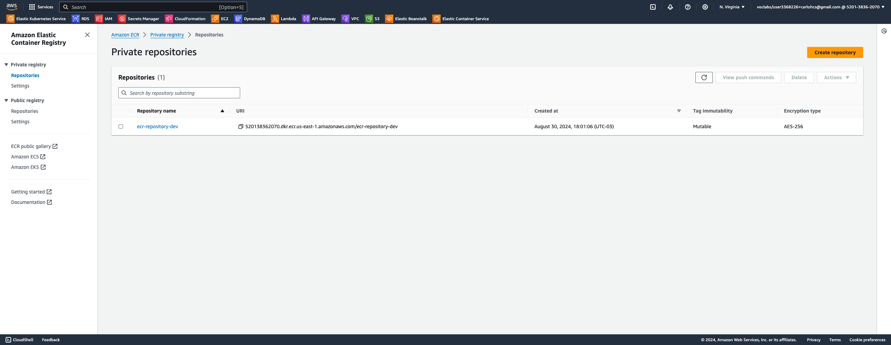

# Example 05 - Docker and Elastic Beanstalk at AWS



This is a Node.js application using AWS Beanstalk to deploy it.

## Application structure

```markdown
                                            -> S3 -> EC2
Docker image -> put at ECR -> Beanstalk     -> Cloudwatch | Load balancer
                                            -> EC2
```

## What is needed to have everything in place

> [!WARNING]  
> **This repository is using an AWS Academy account! You need to make changes at infra/role.tf with standard AWS Accounts**

1. A `S3` bucket to save the zip file containing the `Dockerrun.aws.json` definitions, being the file to provide the current version of the application;



2. An `ECR` _(Elastic Container Registry)_ private repository where the AWS Beanstalk will be fetching the image;



3. A builded `Docker` image from the Node.js application, containing also `Dockerrun.aws.json` file inside of it, pointing to the created;

Docker image example: [https://hub.docker.com/repository/docker/carlohcs/basic-app/general](https://hub.docker.com/repository/docker/carlohcs/basic-app/general)

Repository: [https://github.com/carlohcs/basic-app](https://github.com/carlohcs/basic-app)

4. A Terraform configuration to be able to setup and do the deploying of the main structure of the application.

## Terraform

The application will be delivered through Terraform with a distributed state:

Distributed state is a way we can store Terraform infrastructure state files that brings some advantages for us.

Advantages:

- The state is accessible from multiple locations;
- Facilitates the implementation of continuous delivery routines.

## Getting Started

```bash
terraform init
```

> Terraform will download the necessary provider plugins and set up the backend configuration. This step is typically performed before running any other Terraform commands in a project.

```bash
terraform plan
```

> Terraform analyzes your configuration files and the current state of your infrastructure to determine what changes need to be made. It then generates a detailed report that outlines the actions it will take to achieve the desired state defined in your configuration files. This includes creating new resources, modifying existing resources, or destroying resources that are no longer needed.

```bash
terraform apply
```

> Terraform will apply the changes defined in the Terraform configuration files to the target infrastructure. This command is typically used after making changes to the Terraform configuration files to deploy or update the infrastructure resources.

## 1. Create a S3 bucket

With `aws-cli`:

```bash
aws s3 mb s3://terraform-remote-state-docker-elastic-beanstalk
```

## 2. Push your docker image do ECR

Follow tutorial: [https://docs.aws.amazon.com/AmazonECR/latest/userguide/docker-push-ecr-image.html](https://docs.aws.amazon.com/AmazonECR/latest/userguide/docker-push-ecr-image.html)

### Login to docker

```bash
aws ecr get-login-password --region <region> | docker login --username AWS --password-stdin <aws_account_id>.dkr.ecr.<region>.amazonaws.com
```

or

```bash
aws ecr get-login-password --profile <profile> | docker login --username AWS --password-stdin <aws_account_id>.dkr.ecr.<region>.amazonaws.com
```

eg: `aws ecr get-login-password --profile academy | docker login --username AWS --password-stdin 520138362070.dkr.ecr.us-east-1.amazonaws.com`

### Tag your builded image with AWS approach  

```bash
docker tag <image-id> <aws_account_id>.dkr.ecr.<region>.amazonaws.com/<repository-name>:<version>
```

eg: `docker tag c6fb814806fe 520138362070.dkr.ecr.us-east-1.amazonaws.com/ecr-repository-dev:latest`

### Push the image to AWS ECR

```bash
docker push <aws_account_id>.dkr.ecr.<region>.amazonaws.com/<my-repository>:<version>
```

eg: `docker push 520138362070.dkr.ecr.us-east-1.amazonaws.com/ecr-repository-dev:latest`

### 3. Setup Dockerrun.aws.json

See [Dockerrun.aws.json file](./env/dev/deploy/Dockerrun.aws.json)

> [!WARNING]  
> **This file should be inside of your builded Docker image as well!**

Ref: [https://stackoverflow.com/a/65913675/3929980](https://stackoverflow.com/a/65913675/3929980)

### Zip the Dockerrun.aws.json

```bash
zip -r aws-dockerrun.zip Dockerrun.aws.json
```

### Send to S3 via Terraform

see [./infra/beanstalk.tf](./infra/beanstalk.tf)

## 4. Deploy the application

```bash
terraform apply
```

## How to update my application manually?

Update your zip file containing the `Dockerrun.aws.json` definitions and push it to your S3 bucket.

After run:

```bash
aws elasticbeanstalk update-environment --environment-name <environment-name> --version-label <version-label>
```

eg: `aws elasticbeanstalk update-environment --environment-name development --version-label development`

The application it should started to be deployed. Check at AWS console.

## Tip: if something fails

- Update the `Dockerrun.aws.json` file;
- Zipt it;
- `terraform apply`;
- `aws elasticbeanstalk update-environment --environment-name development --version-label development`;
- wait for the update;

## About beanstalk

It works with versions. So we need to deploy a version and we can switch those versions.

- [https://registry.terraform.io/providers/hashicorp/aws/latest/docs/resources/elastic_beanstalk_application_version](https://registry.terraform.io/providers/hashicorp/aws/latest/docs/resources/elastic_beanstalk_application_version)

- [https://registry.terraform.io/providers/hashicorp/aws/latest/docs/resources/elastic_beanstalk_application_version](https://registry.terraform.io/providers/hashicorp/aws/latest/docs/resources/elastic_beanstalk_application_version)

## References

- [https://developer.hashicorp.com/terraform/language/settings/backends/s3](https://developer.hashicorp.com/terraform/language/settings/backends/s3)
- [https://developer.hashicorp.com/terraform/tutorials/aws-get-started/aws-remote](https://developer.hashicorp.com/terraform/tutorials/aws-get-started/aws-remote)
- [https://registry.terraform.io/providers/hashicorp/aws/latest/docs/resources/iam_role](https://registry.terraform.io/providers/hashicorp/aws/latest/docs/resources/iam_role)
- [https://registry.terraform.io/providers/hashicorp/aws/latest/docs/resources/iam_role_policy](https://registry.terraform.io/providers/hashicorp/aws/latest/docs/resources/iam_role_policy)
- [https://docs.aws.amazon.com/AmazonECR/latest/APIReference/API_Operations.html](https://docs.aws.amazon.com/AmazonECR/latest/APIReference/API_Operations.html)
- [https://registry.terraform.io/providers/hashicorp/aws/latest/docs/resources/iam_instance_profile](https://registry.terraform.io/providers/hashicorp/aws/latest/docs/resources/iam_instance_profile)
- [https://registry.terraform.io/providers/hashicorp/aws/latest/docs/resources/elastic_beanstalk_application](https://registry.terraform.io/providers/hashicorp/aws/latest/docs/resources/elastic_beanstalk_application)
- [https://registry.terraform.io/providers/hashicorp/aws/latest/docs/resources/elastic_beanstalk_environment](https://registry.terraform.io/providers/hashicorp/aws/latest/docs/resources/elastic_beanstalk_environment)
- [https://docs.aws.amazon.com/elasticbeanstalk/latest/dg/concepts.platforms.html](https://docs.aws.amazon.com/elasticbeanstalk/latest/dg/concepts.platforms.html)
- [https://docs.aws.amazon.com/elasticbeanstalk/latest/platforms/platform-history-nodejs.html](https://docs.aws.amazon.com/elasticbeanstalk/latest/platforms/platform-history-nodejs.html)
- [https://registry.terraform.io/providers/hashicorp/aws/latest/docs/resources/elastic_beanstalk_environment#option-settings](https://registry.terraform.io/providers/hashicorp/aws/latest/docs/resources/elastic_beanstalk_environment#option-settings)
- [https://docs.aws.amazon.com/elasticbeanstalk/latest/dg/command-options.html#configuration-options-recommendedvalues](https://docs.aws.amazon.com/elasticbeanstalk/latest/dg/command-options.html#configuration-options-recommendedvalues)
- [https://docs.aws.amazon.com/pt_br/elasticbeanstalk/latest/dg/single-container-docker-configuration.html](https://docs.aws.amazon.com/pt_br/elasticbeanstalk/latest/dg/single-container-docker-configuration.html)
- [https://registry.terraform.io/providers/hashicorp/aws/latest/docs/resources/s3_bucket](https://registry.terraform.io/providers/hashicorp/aws/latest/docs/resources/s3_bucket)