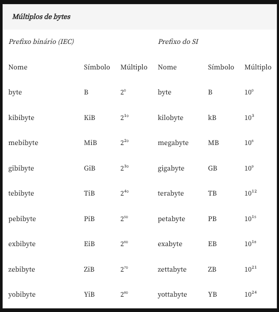

# MiB vs MB | GiB vs GB

Provavelmente você já viu algumas unidades de memória em bytes representadas como GiB ou GB e MiB ou MB. Mas você sabe a diferença entre elas?

Um byte é composto por 8 bits que, por sua vez, o bit (ou dígito binário) é a menor unidade lógica de armazenamento de informação em um computador. Há algumas décadas, as memórias dos computadores raramente ultrapassavam quilobytes (kB), mas foi notado que, apesar da diferença ser pouca, havia uma diferença de interpretação nesse termo. Segundo o SI (Sistema Internacional de Medidas), o prefixo quilo (k) corresponde a 1.000 unidades; dessa forma, um quilobyte (1 kB), corresponderia a 1000 ou 10³ bytes. Por outro lado, tendo como referência a base binária, um quilobyte corresponderia a 2¹⁰ bytes.

A diferença não parecia muito discrepante na época. No entanto, com o passar do tempo, e com a ampliação da capacidade de memória dos computadores ( como na ordem de megabytes, gigabytes e terabytes), a diferença entre o sistema binário e o SI aumentou, e gerou uma diferença significativa no valor dessas unidades.

Com isso, em 1998, a International Electrotechnical Commission (IEC) aprovou e publicou um padrão chamado IEC 60027-2. Este padrão introduziu os prefixos binários kibi, mebi, gibi, tebi, pebi e exbi que são prefixos originais do SI com a junção de bi que é a contração de binário. Depois, com o Instituto de Engenheiros Eletricistas e Eletrônicos (IEEE) esse padrão foi sofrendo modificações, como a adição dos prefixos zebi e yobi que hoje em dia é o ISO-IEC 80000-13.

Segue uma tabela que resume bem os dois padrões:

Para bits também é bastante semelhante:

Como consequência dessa história toda, 1 MB continua representando para alguns 1024 kB e, para outros, medições em 1000 kB. A maioria dos sistemas operacionais considera o prefixo binário com potência de 2. Entretanto, alguns fabricantes de discos rígidos ou de dispositivos SSD, por exemplo, consideram o SI com potência de 10.